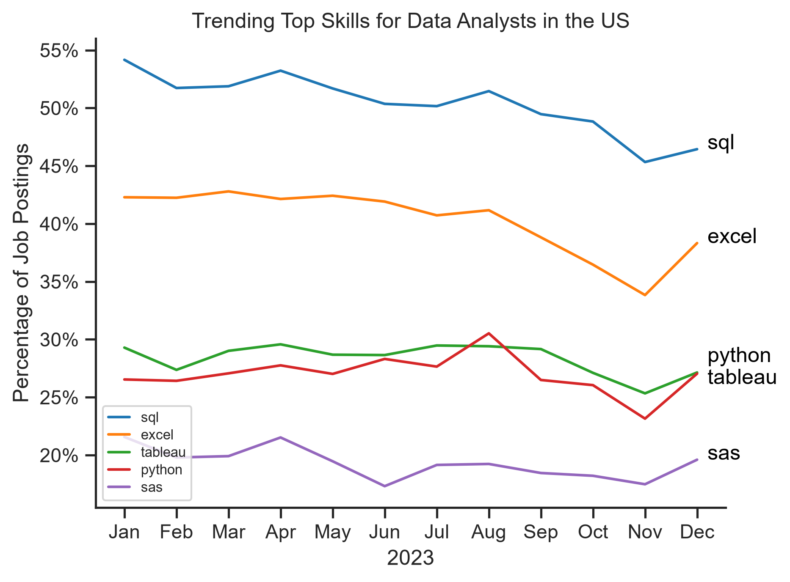
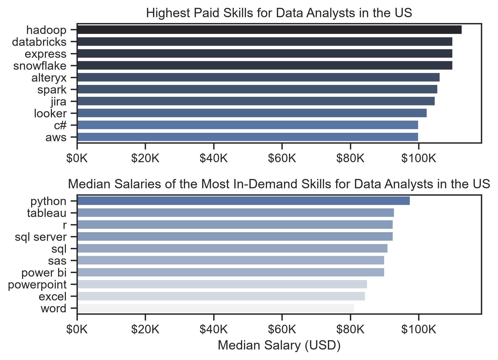
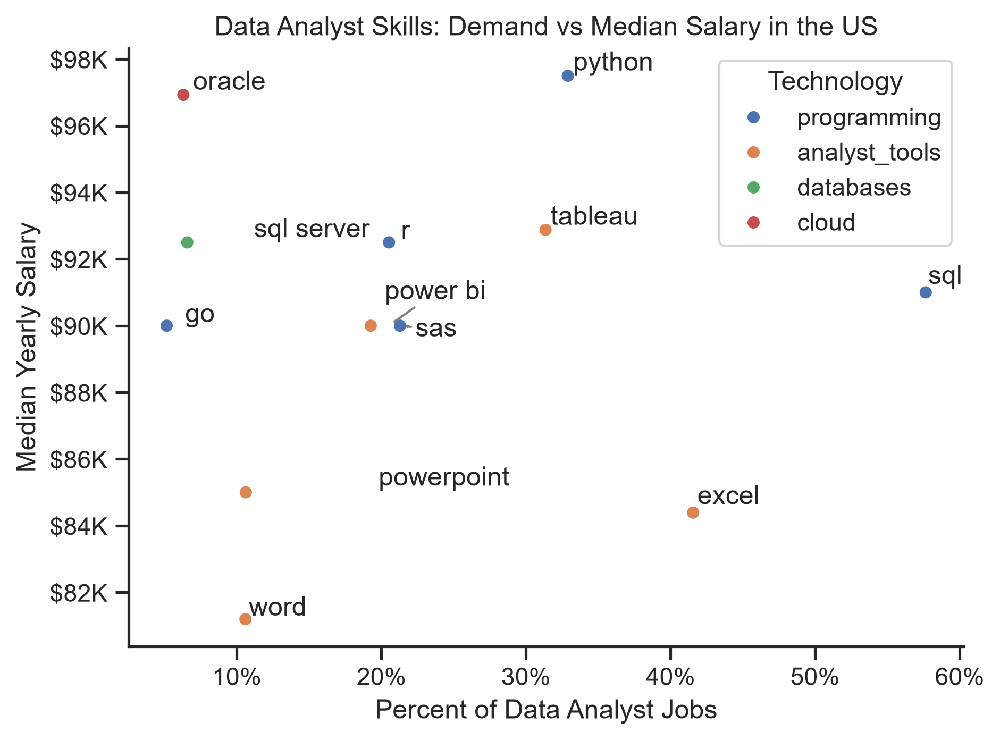

# Overview

Welcome to my analysis of the data job market, focusing on data analyst roles. This project was created out of a desire to navigate and understand the job market more effectively. It delves into the top-paying and in-demand skills to help find optimal job opportunities for data analysts.

The data sourced from [Luke Barousse's Python Course](https://lukebarousse.com/python) which provides a foundation for my analysis, containing detailed information on job titles, salaries, locations, and essential skills. Through a series of Python scripts, I explore key questions such as the most demanded skills, salary trends, and the intersection of demand and salary in data analytics.

# The Questions

Below are the questions I want to answer in my project:

1. What are the skills most in demand for the top 3 most popular data roles?
2. How are in-demand skills trending for Data Analysts?
3. How well do jobs and skills pay for Data Analysts?
4. What are the optimal skills for data analysts to learn? (High Demand AND High Paying) 

# Tools I Used

For my deep dive into the data analyst job market, I harnessed the power of several key tools:

- **Python:** The backbone of my analysis, allowing me to analyze the data and find critical insights.I also used the following Python libraries:
    - **Pandas Library:** This was used to analyze the data. 
    - **Matplotlib Library:** I visualized the data.
    - **Seaborn Library:** Helped me create more advanced visuals. 
- **Jupyter Notebooks:** The tool I used to run my Python scripts which let me easily include my notes and analysis.
- **Visual Studio Code:** My go-to for executing my Python scripts.
- **Git & GitHub:** Essential for version control and sharing my Python code and analysis, ensuring collaboration and project tracking.

# Data Preparation and Cleanup

This section outlines the steps taken to prepare the data for analysis, ensuring accuracy and usability.

## Dataset

The dataset used in this project is not stored directly in the repository because of its file size.

A compressed copy of the exact dataset used for this analysis is available in the repository's Releases section:

[Download `data_jobs.zip`](https://github.com/GauthamMA/python-data-job-market-analysis/releases/download/dataset-v1/data_jobs.zip)

After downloading, extract the archive and place `data_jobs.csv` in the project directory before running the notebooks.

The original dataset was created and published by Luke Barousse as part of his Python data analytics course. This archived copy is included only to preserve the exact version used for this project and improve reproducibility.

## Import & Clean Up Data

I start by importing necessary libraries and loading the dataset, followed by initial data cleaning tasks to ensure data quality.

```python
# Importing Libraries
import ast
import pandas as pd
import seaborn as sns
import matplotlib.pyplot as plt  

# Loading Data
df = pd.read_csv('data_jobs.csv')

# Data Cleanup
df['job_posted_date'] = pd.to_datetime(df['job_posted_date'])
df['job_skills'] = df['job_skills'].apply(lambda x: ast.literal_eval(x) if pd.notna(x) else x)
```
# The Analysis

Each Jupyter notebook for this project aimed at investigating specific aspects of the data job market. Here’s how I approached each question:

## Exploratory Data Analysis

Before moving into the main skill and salary analysis, I explored the U.S. Data Analyst job postings to get a clearer picture of the dataset and the types of opportunities it contains.

I filtered the dataset to Data Analyst roles in the United States and looked at several basic characteristics of the job postings:

- The most common job locations
- The companies with the most Data Analyst job postings
- Job schedule types such as full-time, contract, part-time, internship and temporary work
- The proportion of postings offering work-from-home options
- Whether a degree was mentioned in the posting
- Whether health insurance was offered

This initial exploration helped me understand the structure of the Data Analyst job market represented in the dataset before moving on to the more detailed skill, salary and trend analysis.

View the exploratory notebook here: [1_EDA_intro](0_EDA_intro.ipynb).

I first explored the U.S. Data Analyst job postings to understand their locations, employers, schedule types and several job characteristics.

[](0_EDA_intro.ipynb)


## Filter US Jobs

To focus my analysis on the U.S. job market, I apply filters to the dataset, narrowing down to roles based in the United States.

```python
df_US = df[df['job_country'] == 'United States']

```
## 1. What are the most demanded skills for the top 3 data roles?

I identified the three most common data roles in the U.S. job market and compared the five skills most frequently requested for each role.

The `job_skills` column was expanded using `explode()` so that each skill could be counted individually. I then grouped the data by skill and job role, calculated the percentage of postings mentioning each skill, and compared the results across the top three roles.

[View the Skill Demand notebook](1_Skill_Demand.ipynb)

### Visualisation

```python
fig, ax = plt.subplots(len(job_titles), 1)

for i, job_title in enumerate(job_titles):
    df_plot = df_skills_perc[
        df_skills_perc['job_title_short'] == job_title
    ].head(5)

    sns.barplot(
        data=df_plot,
        x='skill_percent',
        y='job_skills',
        ax=ax[i],
        hue='skill_percent',
        palette='dark:b_r',
        legend=False
    )

    ax[i].set_title(job_title)
    ax[i].set_ylabel('')
    ax[i].set_xlabel('')
    ax[i].set_xlim(0, 100)

    if i != len(job_titles) - 1:
        ax[i].set_xticks([])

    for n, v in enumerate(df_plot['skill_percent']):
        ax[i].text(v + 1, n, f'{v:.0f}%', va='center')

fig.suptitle(
    'Percentage of US Job Postings Requesting Each Skill',
    fontsize=15
)

fig.tight_layout(h_pad=.8)
plt.show()
```

### Results


*Percentage of U.S. job postings requesting the five most common skills for Data Analysts, Data Engineers and Data Scientists.*

### Insights

- **SQL** is requested in roughly half of Data Analyst and Data Scientist postings, making it one of the most consistently demanded skills across the roles.
- **Python** is especially prominent for Data Scientists and Data Engineers, appearing in a large proportion of their job postings.
- Data Engineer postings show stronger demand for infrastructure and cloud-related technologies such as **AWS, Azure and Spark**, while Data Analyst postings place greater emphasis on tools such as **Excel and Tableau**.
- Converting raw skill counts to percentages makes the three roles easier to compare because each role has a different total number of job postings.

## 2. How are in-demand skills trending for Data Analysts?

I analysed how demand for the five most common Data Analyst skills changed throughout 2023 in the United States.

The data was filtered to U.S. Data Analyst roles, and the `job_skills` column was expanded using `explode()`. I then grouped skill occurrences by month and used a pivot table to compare monthly demand across skills.

Because the total number of job postings changes from month to month, raw skill counts were converted into percentages of monthly Data Analyst postings. This makes the trends more comparable across the year.

[View the Skill Trends notebook](2_skills_trend.ipynb)

### Visualisation

```python
from matplotlib.ticker import PercentFormatter

df_plot = df_DA_US_percent.iloc[:, :5]

sns.lineplot(
    data=df_plot,
    dashes=False,
    legend='full',
    palette='tab10'
)

plt.ylabel('Percentage of Job Postings')
plt.xlabel('2023')

plt.gca().yaxis.set_major_formatter(
    PercentFormatter(decimals=0)
)

plt.show()
```


### Results


 
Monthly percentage of U.S. Data Analyst job postings requesting each of the five most commonly requested skills in 2023.


### Insights

- SQL remained the most frequently requested skill throughout the year, although its share of postings generally declined toward the end of 2023.
- Excel remained the second most common skill and also declined during the second half of the year before recovering in December.
- Python and Tableau stayed relatively close in demand across much of the year, with both appearing in roughly a quarter to a third of postings.
- SAS had the lowest demand among the five skills shown and remained comparatively stable through the year.
- Converting monthly counts into percentages helps separate changes in skill demand from changes in the overall number of Data Analyst job postings.


## 3. How well do jobs and skills pay for Data Analysts?

I compared salary distributions across the six most common data roles in the United States and then examined how salary varies by skill for Data Analyst positions.

The analysis first filters the dataset to U.S. job postings with reported annual salary data. The six most common data roles are then compared using a boxplot so that both median salary and salary spread can be examined.

For the Data Analyst skill-level analysis, the `job_skills` column is expanded using `explode()` and median salary is calculated for each skill.

To make the highest-paid skill ranking more reliable, I only included skills with at least 50 salary observations before ranking them by median salary. This reduces the influence of skills that appear in only a very small number of salary-reporting postings.

[View the Salary Analysis notebook](3_salary_analysis.ipynb)

### Salary Distribution by Role

```python
sns.boxplot(
    data=df_US_top6,
    x='salary_year_avg',
    y='job_title_short',
    order=job_order
)

plt.title('Salary Distributions of Data Jobs in the US')
plt.xlabel('Yearly Salary (USD)')
plt.ylabel('')
plt.xlim(0, 600000)

ticks_x = plt.FuncFormatter(
    lambda y, pos: f'${int(y/1000)}K'
)

plt.gca().xaxis.set_major_formatter(ticks_x)

plt.show()
```
#### Highest-Paid and Most In-Demand Skills

```python
min_count = 50

df_DA_top_pay = (
    df_DA_US
    .groupby('job_skills')['salary_year_avg']
    .agg(['count', 'median'])
)

df_DA_top_pay = (
    df_DA_top_pay[df_DA_top_pay['count'] >= min_count]
    .sort_values(by='median', ascending=False)
    .head(10)
)

df_DA_skills = (
    df_DA_US
    .groupby('job_skills')['salary_year_avg']
    .agg(['count', 'median'])
    .sort_values(by='count', ascending=False)
    .head(10)
    .sort_values(by='median', ascending=False)
)
```

The first chart shows the skills with the highest median salaries after applying the minimum-observation threshold.
The second chart starts with the ten most frequently mentioned skills in Data Analyst postings and compares the median salaries associated with those skills.

### Results


 
Comparison of median salaries for the highest-paid qualifying skills and the most frequently requested skills in U.S. Data Analyst postings. Highest-paid skills were required to have at least 50 salary observations.


#### Insights

- Among skills with at least 50 salary observations, Hadoop has the highest median salary, followed closely by Databricks, Express and Snowflake.
- Several specialised data-platform and infrastructure skills, including Hadoop, Databricks, Snowflake, Spark and AWS, are associated with median salaries around or above $100K.
- Among the most frequently requested Data Analyst skills, Python has the highest median salary at just under $100K.
- Tableau, R, SQL Server and SQL combine relatively high demand with median salaries around the $90K range.
- Widely requested productivity tools such as Excel, PowerPoint and Word have lower median salaries than many of the more technical skills.
- The comparison shows that the skills associated with the highest salaries are not necessarily the skills that appear most frequently in Data Analyst job postings.

## 4. Which Data Analyst skills combine high demand and high salary?

Finally, I compared skill demand with median salary to identify skills that combine relatively strong demand with higher compensation in U.S. Data Analyst job postings.

The analysis uses U.S. Data Analyst postings with reported annual salaries. After expanding the `job_skills` column using `explode()`, I calculated the number of postings mentioning each skill, its median salary, and its percentage of salary-reporting Data Analyst postings.

To keep the comparison focused on reasonably common skills, only skills appearing in more than 5% of these postings were included in the final analysis.

[View the Optimal Skills notebook](4_optimal_skills.ipynb)

### Demand vs Median Salary

```python
df_DA_skills = (
    df_DA_US_exploded
    .groupby('job_skills')['salary_year_avg']
    .agg(['count', 'median'])
    .sort_values(by='count', ascending=False)
)

df_DA_skills = df_DA_skills.rename(
    columns={
        'count': 'skill_count',
        'median': 'median_salary'
    }
)

DA_job_count = len(df_DA_US)

df_DA_skills['skill_percent'] = (
    df_DA_skills['skill_count']
    / DA_job_count
    * 100
)

min_skill_percent = 5

df_DA_skills_high_demand = df_DA_skills[
    df_DA_skills['skill_percent'] > min_skill_percent
]
```

The x-axis represents the percentage of salary-reporting Data Analyst postings requesting each skill, while the y-axis represents the median annual salary associated with postings mentioning that skill.

Skills further to the right are more frequently requested, while skills higher on the chart are associated with higher median salaries.

### Technology Categories

The dataset also contains technology-category information. I converted these category mappings into a separate DataFrame and merged them with the skill analysis so that each skill could be classified by technology type.

This allows the final scatter plot to show three dimensions:

- **X-position:** skill demand
- **Y-position:** median salary
- **Colour:** technology category

### Results



*Demand and median salary for commonly requested Data Analyst skills in U.S. salary-reporting job postings. Only skills appearing in more than 5% of these postings are shown.*

### Insights

- Skills differ considerably in both how frequently they are requested and the median salaries associated with them.
- Highly demanded skills are not automatically the highest-paying skills, showing a trade-off between market demand and salary.
- Skills positioned toward the upper-right of the chart combine relatively strong demand with relatively high median salaries.
- Categorising skills by technology type helps show how programming languages, analyst tools, databases, cloud technologies and other skill groups occupy different parts of the demand-salary landscape.
- This analysis identifies associations between skills and salaries within the dataset; it does not imply that learning a particular skill directly causes a higher salary.


# What I Learned

Throughout this project, I deepened my understanding of the data analyst job market and enhanced my technical skills in Python, especially in data manipulation and visualization. Here are a few specific things I learned:

- **Advanced Python Usage**: Utilizing libraries such as Pandas for data manipulation, Seaborn and Matplotlib for data visualization, and other libraries helped me perform complex data analysis tasks more efficiently.
- **Data Cleaning Importance**: I learned that thorough data cleaning and preparation are crucial before any analysis can be conducted, ensuring the accuracy of insights derived from the data.
- **Strategic Skill Analysis**: The project emphasized the importance of aligning one's skills with market demand. Understanding the relationship between skill demand, salary, and job availability allows for more strategic career planning in the tech industry.


# Insights

This project provided several general insights into the data job market for analysts:

- **Skill Demand and Salary Correlation**: There is a clear correlation between the demand for specific skills and the salaries these skills command. Advanced and specialized skills like Python and Oracle often lead to higher salaries.
- **Market Trends**: There are changing trends in skill demand, highlighting the dynamic nature of the data job market. Keeping up with these trends is essential for career growth in data analytics.
- **Economic Value of Skills**: Understanding which skills are both in-demand and well-compensated can guide data analysts in prioritizing learning to maximize their economic returns.


# Challenges I Faced

This project was not without its challenges, but it provided good learning opportunities:

- **Data Inconsistencies**: Handling missing or inconsistent data entries requires careful consideration and thorough data-cleaning techniques to ensure the integrity of the analysis.
- **Complex Data Visualization**: Designing effective visual representations of complex datasets was challenging but critical for conveying insights clearly and compellingly.
- **Balancing Breadth and Depth**: Deciding how deeply to dive into each analysis while maintaining a broad overview of the data landscape required constant balancing to ensure comprehensive coverage without getting lost in details.


# Conclusion

This exploration into the data analyst job market has been incredibly informative, highlighting the critical skills and trends that shape this evolving field. The insights I got enhance my understanding and provide actionable guidance for anyone looking to advance their career in data analytics. As the market continues to change, ongoing analysis will be essential to stay ahead in data analytics. This project is a good foundation for future explorations and underscores the importance of continuous learning and adaptation in the data field.


